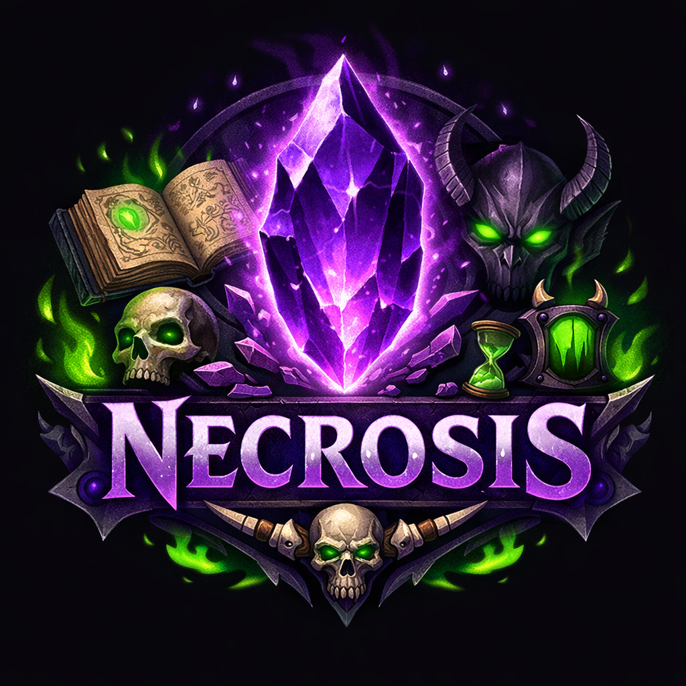
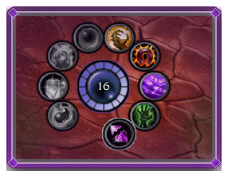
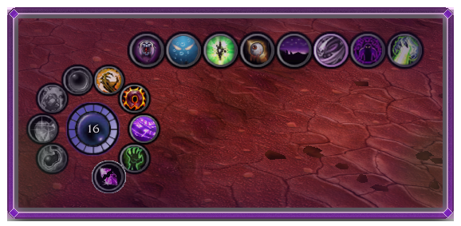
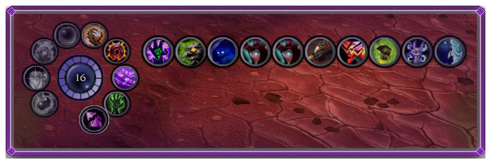
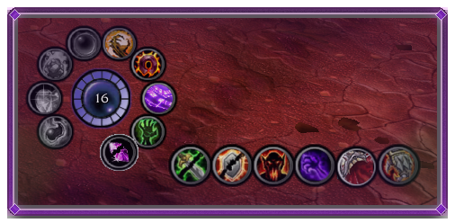
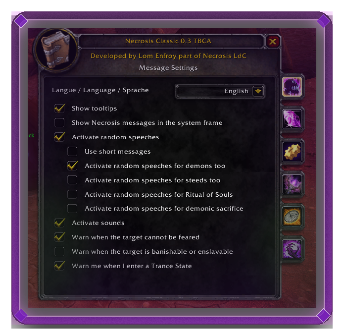
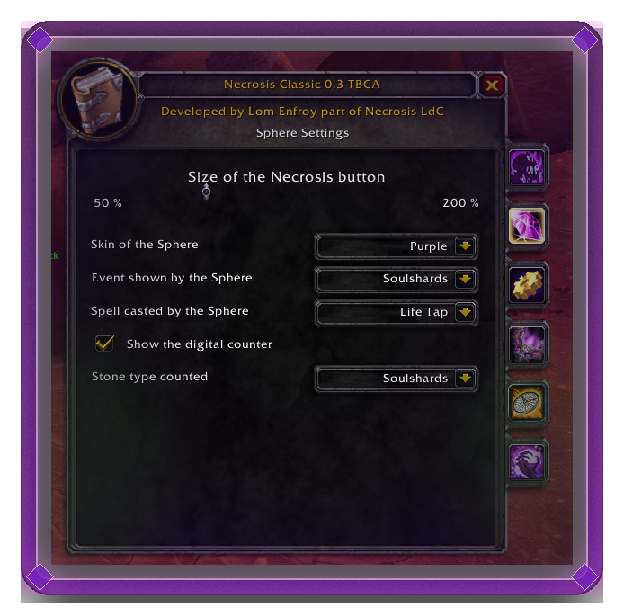
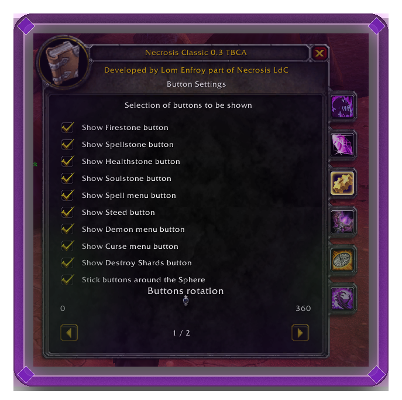

# Necrosis-Classic

Warlock helper addon for **WoW Classic: Burning Crusade Classic Anniversary**.

**Get it:**
- **CurseForge (auto install/updates):** https://www.curseforge.com/wow/addons/necrosis-classic-tbc-anniversary
- **GitHub Releases (auto install/updates):** https://wowup.io/

Necrosis-Classic is a rewrite/modernization of the classic Necrosis-style workflow: a central “sphere” UI with quick access to shards, stones, demons, curses, buffs, and optional timers.

> Not affiliated with Blizzard Entertainment.

---

## Features

- **Soul shard management**
  - Shard count + bag targeting
  - Optional shard “overload” behaviors (alerts / cleanup)
- **Stone management**
  - Create/use Soulstone, Healthstone, Firestone, Spellstone (where available)
- **One-click menus**
  - Demon/pet menu
  - Curse menu
  - Buff/utility menu
- **Timers (optional)**
  - DoT timers
  - Buff/proc indicators (as supported by the client/API)
- **Quality-of-life**
  - Visual indicator for fear-immunity/unfearable targets (when detectable)

> Exact feature coverage depends on the Anniversary client API and ongoing rewrite progress.

---

## Compatibility

**Target:** Burning Crusade Classic Anniversary (Anniversary realms progressing into TBC).  
**Not intended for:** Retail, Wrath/Cata Classic, or Era-only clients (unless explicitly stated in releases).

If the addon shows as “out of date” after a patch, try:
- Enabling **“Load out of date AddOns”** on the character select screen
- Installing the latest release (recommended)

---

## Installation

### Install via CurseForge (automatic updates)
Install from CurseForge (recommended for auto-updates):  
https://www.curseforge.com/wow/addons/necrosis-classic-tbc-anniversary

### Install from a release (manual)
1. Download the latest `.zip` from **Releases**.
2. Extract into your AddOns folder, e.g. one of:
   - `World of Warcraft/_anniversary_/Interface/AddOns/`
   - `World of Warcraft/_classic_era_/Interface/AddOns/`
3. Ensure the folder structure looks like:
   - `.../Interface/AddOns/Necrosis-Classic/<addon files + .toc>`
4. Restart the game (or `/reload`) and enable the addon.

---

## Screenshots / Previews
<table>
  <tr>
    <td>
      
    </td>
    <td>
      
    </td>
    <td>
      
    </td>
  </tr>

  <tr>
    <td>
      
    </td>
    <td>
      
    </td>
    <td>
      
    </td>
  </tr>

  <tr>
    <td>
      
    </td>
    <td>
      
    </td>
    <td></td>
  </tr>
</table>

